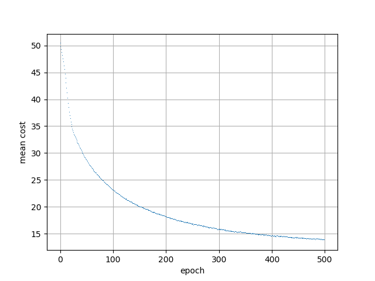
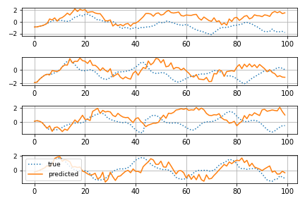

# Conditional Restricted Boltzmann Machine

See references.

 

This repository was forked from the [gist code](https://gist.github.com/gwtaylor/2505670) implemented by Graham W. Taylor. 

## Requirements

- Theano

# References

- G.W. Taylor, G.E. Hinton, and S. Roweis, *Modeling Human MotionUsing Binary Latent Variables*, **NIPS**, 2006.
- G.W. Taylor and G.E. Hinton, *Factored Conditional Restricted Boltzmann Machines for Modeling Motion Style*, **ICML**, 2009.
