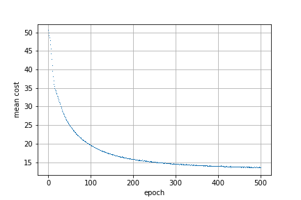
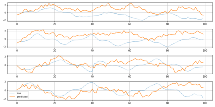

# [Conditional Restricted Boltzmann Machine](https://www.cs.toronto.edu/~hinton/absps/fcrbm_icml.pdf)

 

# Reference

[Factored Conditional Restricted Boltzmann Machinesfor Modeling Motion Style](https://www.cs.toronto.edu/~hinton/absps/fcrbm_icml.pdf) by Graham W. Taylor and Geoffrey E. Hinton.

Forked from the [gist code](https://gist.github.com/gwtaylor/2505670) implemented by Graham W. Taylor. 

## Requirements

- Theano-1.0.4
